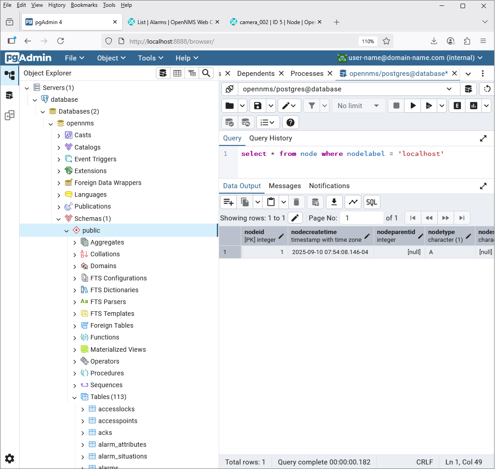

# Session 4 - Additional Event and Alarm Enrichment

[Main Menu](../README.md) | [Session 4](../session4/README.md)

[Session 4 Video](https://youtu.be/DzmvuQRQfXQ)  (first part reviews answer to session 3, at 50 min we look at Event Translator)

## Introduction

We have looked at various techniques for creating event and alarm configurations from SNMP Mibs.

In this session we will look at various other tools which can group, enhance or modify events and alarms to provide more meaningful service impact information to users. 

## Viewing the OpenNMS database

We have included a database viewer pgAdmin4 at http://localhost:8888/

username: user-name@domain-name.com

password: minad1234

Please enter the password for the user 'postgres' to connect the server - "database" : postgres

## Event Translator

Often, not all of the information required to provide useful events is in a given trap and the resulting event needs enriched from additional data sources.

The [Event Translator](https://docs.opennms.com/horizon/33/operation/deep-dive/events/event-translator.html) is a tool which can create a new event from an existing event which is enriched with data from the database.

[Exercise-4-1](../session4/Exercise-4-1.md) walks through the process of creating an example event translator.

